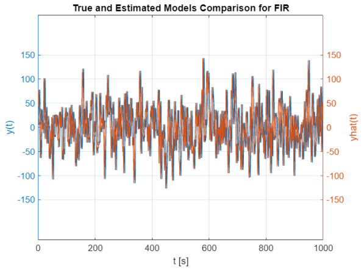
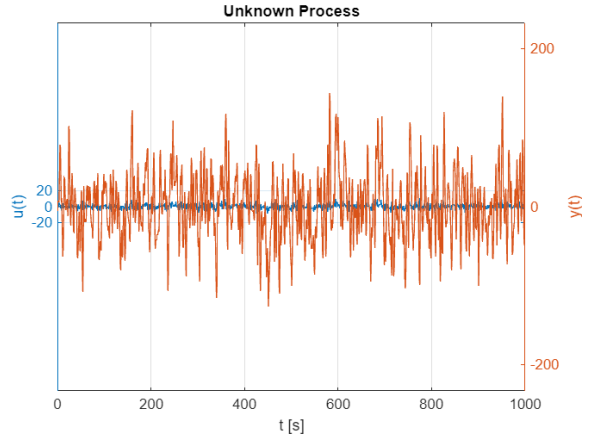
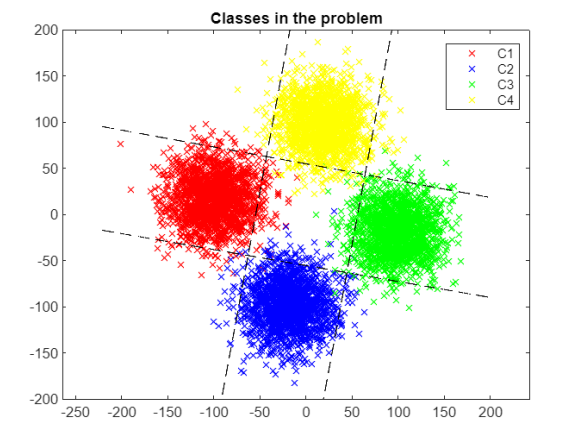
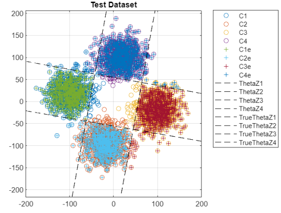

# Model Identification and Multi-Class Logistic Regression

[](https://www.mathworks.com/products/matlab.html)  
Model estimation, validation, and classification in dynamical systems using MATLAB.

---

## 🧠 About the Project

This project includes two separate but related assignments developed for the **Learning and Estimation of Dynamical Systems** course, MSc in Automation Engineering (First Year) – University of Bologna.

- **Part 1**: System Identification of an unknown linear stochastic model (ARX/FIR).
- **Part 2**: Multi-Class Logistic Regression for classification based on Newton-Raphson optimization.

Developed entirely in **MATLAB** with structured scripts and custom function libraries.

---

## 🗂 Project Structure

```
📦 model-identification-logistic-regression/
├ 📁 Functions/                         # Custom reusable MATLAB functions
├ 📁 Images/                            # Output plots and diagrams
│  ├ 📸 Models_Comparison.png           # Task 1: Model validation plot
│  ├ 📸 Unknown_Model.png               # Task 1: Unknown system residuals
│  ├ 📸 MultiClass_Train.png            # Task 2: Training data visualization
│  ├ 📸 MultiClass_Test.png             # Task 2: Test data classification
├ 📄 Perna_Andrea.mlx                   # Complete MATLAB Live Script
├ 📄 Project_Request.mlx                # Project request & initial setup
├ 📘 Assignment_25_07.pdf               # Official Report (detailed explanations)
├ 📄 README.md                          # You are here!
```

---

# 📈 Part 1: Model Identification (Estimation)

---

## Overview

The objective is to identify an unknown linear system using only input/output data samples.  
The model could belong either to the **ARX** (AutoRegressive with eXogenous inputs) or **FIR** (Finite Impulse Response) class.

✅ Major steps:
- Data acquisition
- Structure choice (ARX or FIR)
- Least Squares Estimation (LSE)
- Model order selection
- Model validation (residuals analysis)

---

## 📷 Model Identification Overview

<p align="center">
  
  
</p>

- **Models_Comparison**: Overlay of system output vs model output for different identified structures.
- **Unknown_Model**: Behavior of the real unknown model used as benchmark.

---

## 📋 Methodology

### 1. Data Acquisition
- 40,000 samples were collected.
- Variables:
  - `u(t)`: Input signal
  - `y(t)`: Output signal

### 2. Model Structure Choice
- Both ARX and FIR models initially considered.
- Key difference:
  - **ARX**: Includes past output values.
  - **FIR**: Only input excitation, no feedback.

### 3. Least Squares Estimation
- Developed **custom LSE routines**:
  - `myLS.m`: Estimates the parameter vector `Θ̂`.
  - `myHank.m`: Builds the regressor Hankel matrix depending on the structure (ARX/FIR).

- Optimization Target:
  ```math
  min_Θ || y(t) - H(t)Θ ||²
  ```

### 4. Model Order Estimation
- Several methods applied:
  - Loss function stabilization
  - FPE (Final Prediction Error)
  - MDL (Minimum Description Length)

Result:
- FIR model: **order 4**
- ARX model: **order 3**

### 5. Model Validation
- **Whiteness Test**:
  - Residuals must behave like zero-mean white noise.
- **Cross-Correlation Test**:
  - Residuals uncorrelated with input.
- **Final Model Selection**:
  - FIR structure proved to match the unknown system better.

---

## 🔍 Key Scripts

- `myLS.m` – Least Squares Estimation
- `myCostFunc.m` – Cost function evaluation
- `myFPE.m` / `myMDL.m` – Model order estimators
- `residuals.m` – Residual computation
- `gaussianTest.m`, `andersonTest.m`, `chi2Test.m` – Statistical validation tools

---

# 🧠 Part 2: Multi-Class Logistic Regression (Classification)

---

## Overview

The objective is to build a classifier able to distinguish between **four classes** using a **Multi-Class Logistic Regression** approach via **Newton-Raphson** optimization.

✅ Major steps:
- Dataset generation (training and test sets)
- Problem modeling as One-vs-All
- Logistic Regression parameter estimation
- Classification and error evaluation

---

## 📷 Logistic Regression Overview

<p align="center">
  
  
</p>

- **MultiClass_Train**: Training dataset distribution across the four classes (C1–C4).
- **MultiClass_Test**: Classification result and decision boundaries over the test set.

---

## 📋 Methodology

### 1. Feature Space Analysis
- Training dataset: 10,000 points with class labels (C1, C2, C3, C4).
- Clear separability detected through 2D visualization.

### 2. Logistic Regression Setup
- Probability model based on the **Logistic Sigmoid** function:
  ```math
  P(C_i | u(t)) = \sigma(Θ_i^T φ(t))
  ```

- Multi-class handled via **One-vs-All strategy**:
  - Four independent binary logistic regressions, one per class.

### 3. Newton-Raphson Optimization
- Algorithm customized inside `NewtonRaphson.m`:
  - Gradient and Hessian calculation in `LRCostFuncDeriv.m`.
  - Logistic loss function in `myLRCostFunc.m`.
- Iterative procedure with convergence based on cost decrease.

### 4. Testing and Results
- Hyperplanes were estimated and compared against `mnrfit()` (official MATLAB).
- Decision boundaries plotted for both training and test datasets.
- Very low classification errors (~1.5%-2%).

---

## 📊 Key Results

| Classifier | Classification Error (Test Set) |
|------------|----------------------------------|
| C1         | 2.07%                           |
| C2         | 1.77%                           |
| C3         | 1.77%                           |
| C4         | 1.43%                           |

✅ Newton-Raphson delivered results practically identical to MATLAB's official logistic regression solver.

---

## 🔍 Key Scripts

- `Sigmoid.m` – Logistic Sigmoid function
- `binaryClassification.m` – Transform problem for One-vs-All
- `NewtonRaphson.m` – Custom Newton-Raphson optimizer
- `myLRCostFunc.m` – Loss function evaluation
- `LRCostFuncDeriv.m` – Gradient and Hessian computations

---

## 📅 Year

2024

---

## 👨‍🎓 Author

- Andrea Perna

📧 andrea.perna3@studio.unibo.it

---

## 👩‍🏫 Supervisor

- Prof. Roberto Diversi

---

## 📎 Resources

- [📘 Full Assignment Report (Assignment_25_07.pdf)](./Assignment_25_07.pdf)
- [📄 Project Implementation](Perna_Andrea.mlx)
- [📄 Project Request Specifications](Project_Request.mlx)

---

## 📜 License

All rights reserved. Educational use only.

---
